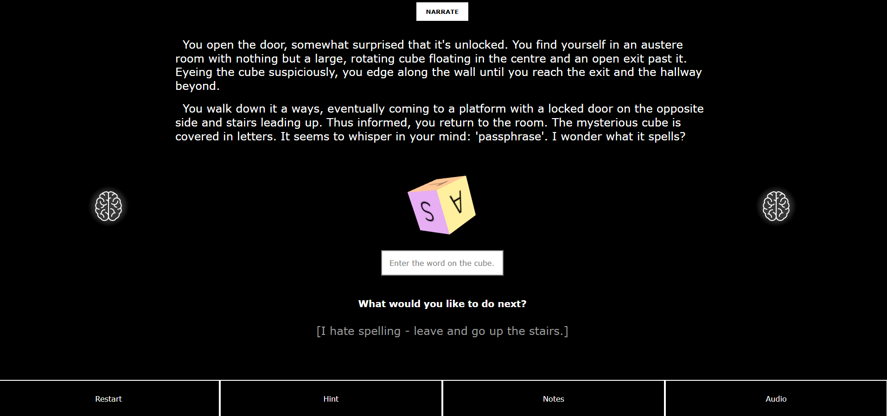

# Gamebook Web

<details>
  <summary>Table of Contents</summary>
  
  1. [Overview](#overview)
  2. [Features](#features)
  3. [UI](#ui)
  4. [Assets](#assets)
  5. [Screenshots](#screenshots)
  6. [Set Up](#setup)
</details>

## <a id="overview">Overview</a>
Gamebook Web is a text-based gamebook with interactive puzzles and branching narratives. It has mobile responsive design, but is optimized for desktop. Play it here: [https://gamebook-web.netlify.app/](https://gamebook-web.netlify.app/)

## <a id="features">Features</a>
- Custom sound effects and writing
- Branching narrative based on player choices
- Story pages built from a template with information pulled from a JSON file based on URL endpoint
- Page-specific hints and auto-filled notes on completion of certain puzzles
- Puzzles and interactive elements using React's Motion library
- Session storage to persist your game state until restart or tab close
- TTS narration using Web Speech API
- Speech recognition using Web Speech API
- Dynamic value text input fields
- Bad word filter for text submission and speech recognition using bad-words library
- Music and symbols that change based on page location
- Music volume and pause/play controls
- Toggleable text fade-in animation 
- Mobile responseive design
- Server-linked Wall of Fame where players who get a successful ending can post their name


##  <a id="ui">UI</a>
### Title Page
- Click [Begin] to start the story.
- Click the toggle switch to toggle "Text Fade In" (default on). With this on, text will fade in one paragraph at a time. With this off, all text will be available immediately on each page.

### Story Pages
- Narrate: Not into reading? Press the "Narrate" button at the top of the screen to activate TTS (text-to-speech).
- Restart: Click to bring you back to the beginning and reset your game state. On desktop, it's the "Restart" in the bottom menu. On mobile, it's the restart icon on the top left of the screen.
- Hints: Open the hints drawer in the bottom menu to see page-specific hints or information. Avoid clicking this to challenge yourself!
- Notes: Open the notes drawer in the bottom menu to see any information you've collected that you might need for later. These notes autofill and indicate words you may need to type or speak.
- Audio: On desktop, click the "Audio" drawer in the bottom menu to control the music volume with a slider or turn it on and off with the speaker icon. On mobile, turn the music on and off with the speaker icon at the top of the screen. Note that there are no controls for narrate/sound effect volume at this time - please use your system or device settings.
- Choices: Choices are indicated by [square brackets]. Click on a choice to be taken to the corresponding story page. Note that some choices only become available after you complete a puzzle on the page.
- Scrolling: If there is more text below the viewport, it will be indicated by "More below" in the bottom centre of the screen. Use your mouse's scroll wheel (or swipe on mobile) to scroll down to see more text or options.

##  <a id="assets">Assets</a>
- See full attributions for music and icons here: [Client Repo](https://github.com/lmolsen/lisa-olsen-capstone/tree/main/capstone-client).
- Writing, sound effects, and other images were created by me.


## <a id="screenshots">Screenshots</a>
The title page welcoming the user.


An example of a text-only story page.


An example of a bad ending.


An example of a puzzle with the associated hint.


An example of a Motion-based puzzle.



The puzzle solved with a matching auto-filled note (answer redacted).


A page with a speech recognition element, showing the button hover color.


An example of a good ending, showing the audio drawer with music controls open.


The Wall of Fame in mobile view, with a record of users who have achieved good endings, and the credits page in mobile view, with hover over the Narrate button.
|  |  |
|---------------------------------------|----------------------------------|

##  <a id="setup">Set Up</a>

**1. Clone the repository**
  ```bash
  git clone https://github.com/lmolsen/lisa-olsen-capstone.git
  ```
  
**2. Navigate to each directory on different terminals**

- **Client**
  ```bash
  cd capstone-client
  ```

- **Server**
  ```bash
  cd capstone-server
  ```

**3. Create .env file in  client**
- Create a *.env* file in the client directory with the required information.

  ```bash
  VITE_API_URL=http://<your-localhost>:<port>
  ```

**4. Install the dependencies for each**
  ```bash
  npm install
  ```

**5. Start for the dev servers for each**
  ```bash
  npm run dev
  ```

**Notes:**
- Ensure you have node.js installed.
