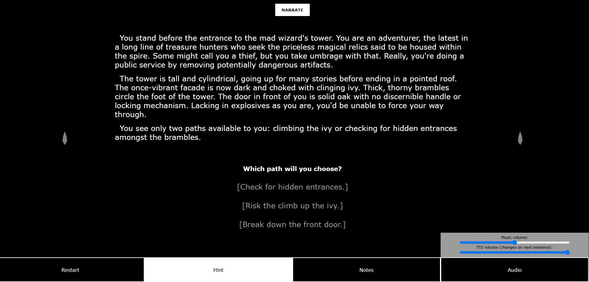
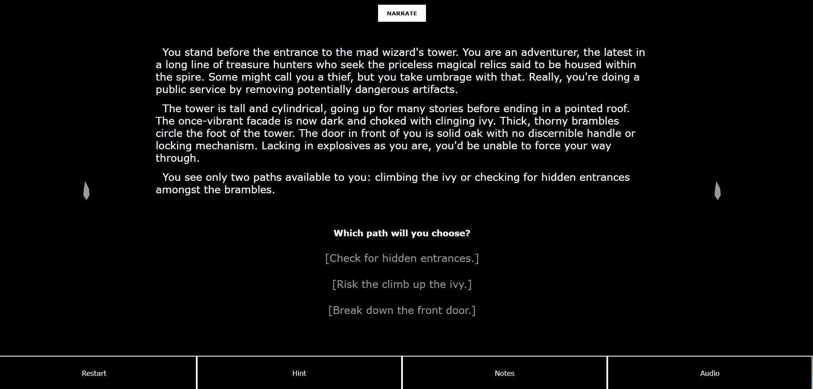
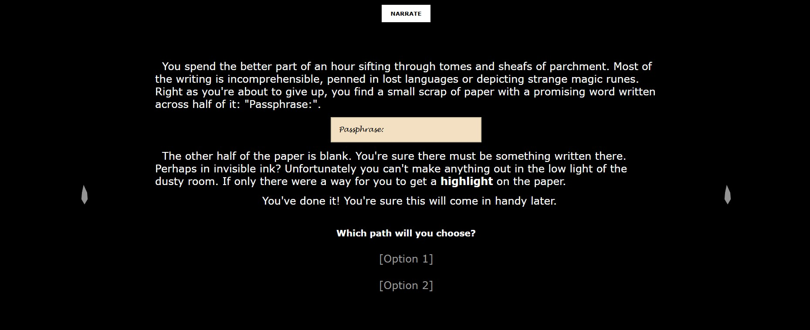
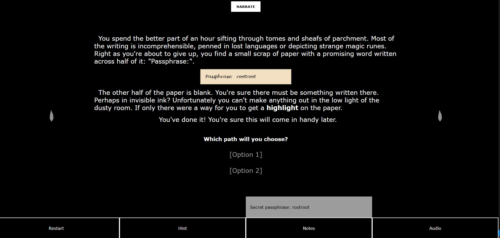
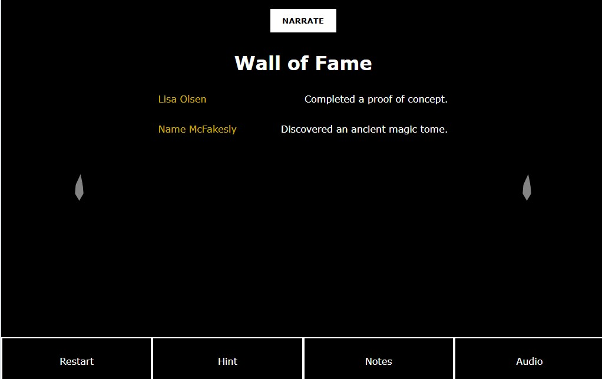
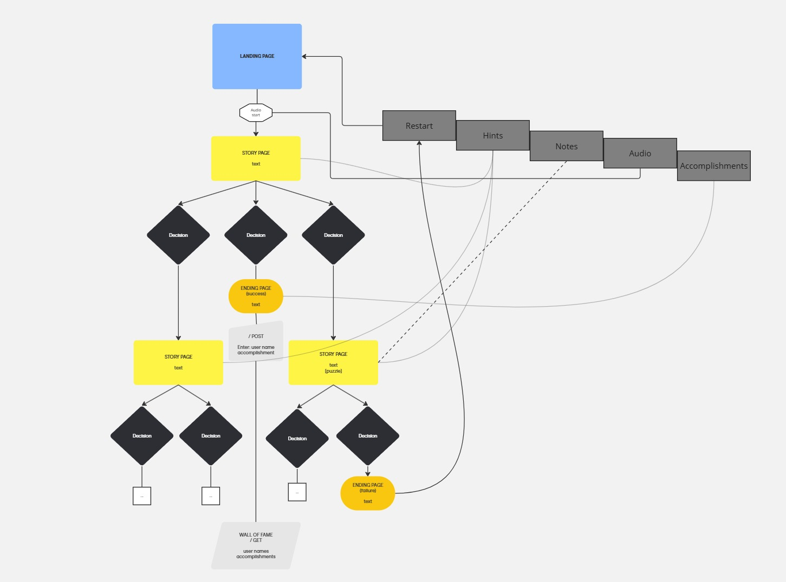

# Project Title
Gamebook Web

## Overview
Gamebook web is an interactive gamebook based on the "Choose Your Own Adventure"-type books.

### Problem Space

My app provides a fun, free, and not overly time-intensive experience that doesn't require the user to sign up for an account or share any data (other than optionally their name). It is meant to invoke feelings of nostalgia for the gamebooks which were popular in the 80s and 90s. It includes text-to-speech for users who prefer it or for those who are sight-imparied or struggle with text-heavy games.

### User Profile

- Fans of text-based games and interactive stories:
    - looking for a quick, fun, and free game
    - looking for a game with replayability
    - looking for a nostalgic experience with a modern twist

### Features

- As a user, I want to be able to jump into playing a game right away without a lot of set up or signing up for an account or service
- As a user, I want to be able to have a different experience when I replay a game
- As a user, I want the option to read and listen to text
- As a user, I want to solve interactive puzzles
- As a user, I want to be able to keep track of my discoveries
- As a user, I want to have access to hints if I need them so I don't get stuck
- As a user, I want to have a record of my accomplishments

## Implementation

### Tech Stack

- React
- Express
- SCSS
- Libraries:
    - react
    - react-router-dom
    - axios
    - express
- Build tool:
    - vite
- Package manager:
    - npm
- Packages:
    - sass
    - dot env
    - cors

### APIs

- No external APIs will be used, but the built-in Web Speech API will be used.

### Sitemap

- Landing/Title page: Welcomes the user and includes a link to start the gamebook
- Story pages: Pages of the "book" with text and choices/results.
- Wall of Fame: Displays names of users (entered by user on story completion) who completed the story successfully with brief text entries about their ending (e.g., "Found the hidden treasure", "Escaped the wizard's tower."). These values will be stored on the server.

### Mockups

Visuals are from a proof of concept.

### Data

- All of the story pages are in routes, linked to via the choices on each page
- A non-successful ending will prompt the user to restart, sending them back to the landing page
- A successful ending will prompt the user to enter their name, POSTING it and the associated accomplishment (every success ending has text associated with it) to the server
- The client GETS the data for the Wall of Fame from the server, which includes all previous posts
- Each page has a narrate button which reads the text on the page aloud
- Each page with a puzzle has an associated hint, and some text pages have an associated comment
- Each puzzle that imparts information upon completion has an associated note
- Music starts once the user enters the first story page, and the volume can be changed via audio controls

 

### Endpoints

#### POST /wall-of-fame

| **Example Request**  | **Example Response**  |
|--------------|---------------|
|  { "name": "John", "accomplishment": "Solved the mystery of the wizard's disappearance." } |   { "message": "Congratulations, John!" } |

---

#### GET /wall-of-fame

| **Example Response**  |
|---------------|
|   [{ "name": "John", "accomplishment": "Solved the mystery of the wizard's disappearance." }, { "name": "Bob", "accomplishment": "Escaped the wizard's tower with their life." }, { "name": "Katie", "accomplishment": "Discovered the hidden treasure trove." } ] |

## Roadmap

- Create client
    - react project with routes and biolerplate pages

- Create server
    - express project with routing

- Map out story using Twine

- Deploy client and server projects

- Feature: Landing/Title page

- Feature: Story Page (text)

- Feature: Story Page (text + puzzle)

- Feature: Narrate button

- Feature: Tool bar and drawers
    - Restart button
    - Hints drawer
    - Notes drawer
    - Audio drawer

- Feature: Hints
    - Hints that correspond to specific page locations

- Feature: Notes
    - Notes that correspond to unlocked information

- Feature: Audio
    - Background music when you start the game
    - Volume control

- Feature: Name submission
    - POST /wall-of-fame

- Feature: Wall of Fame Page
    - GET /wall-of-fame

- Bug fixes

- Demo day

## Future Implementations
- Add responsive design (it's being designed desktop first)
- Let users enter their own notes instead of auto-filling noteworthy info
- Use WebGL to have an animated flame to frame the text
- Use Motion animation library and other libraries for interactive puzzles and animations
- Add additional gamebooks with different themes for the user to choose from
- Use localStorage to save the user's progress
- Refactor to use JSON data file and template pages instead of full set of pages

